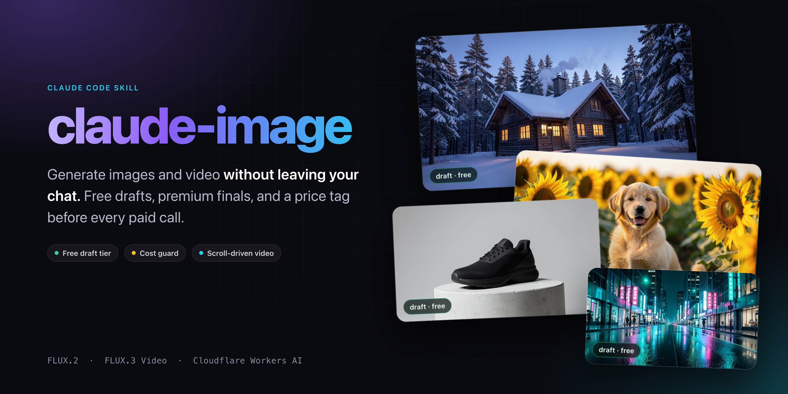
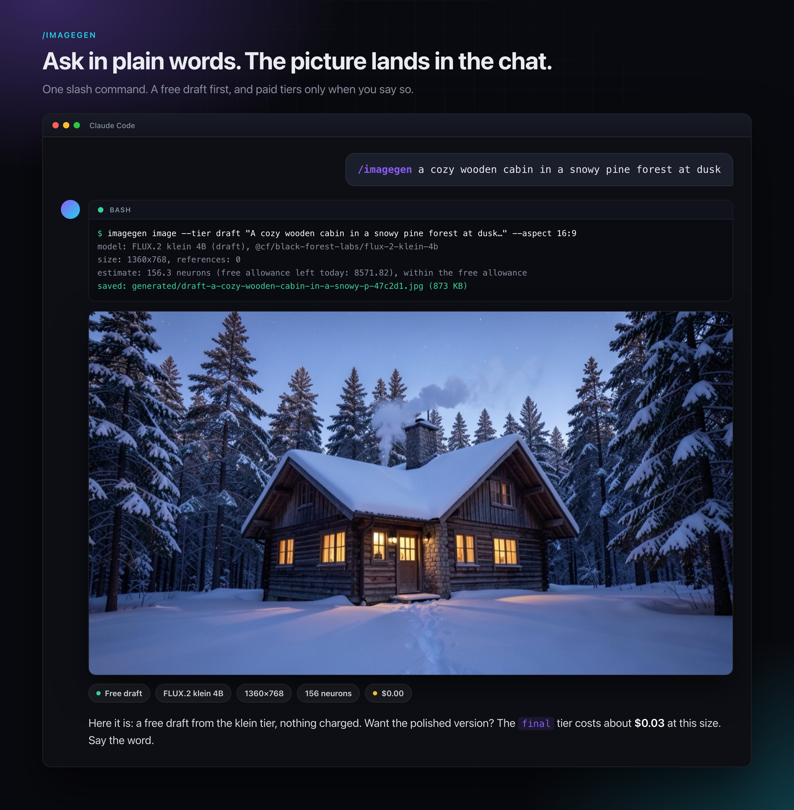
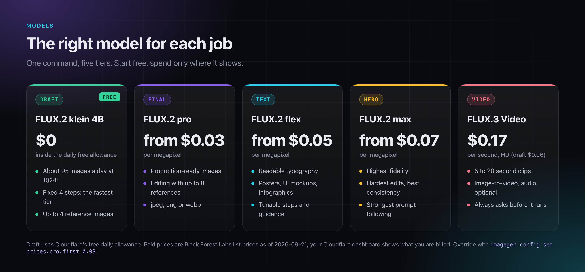
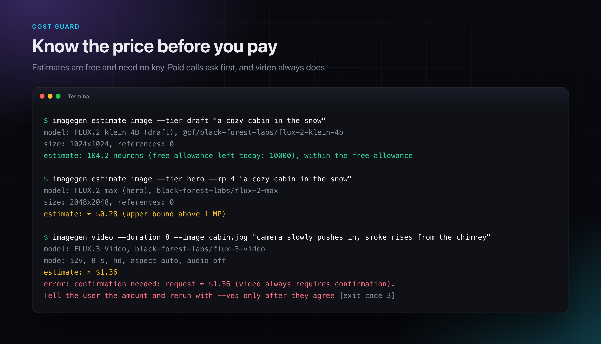
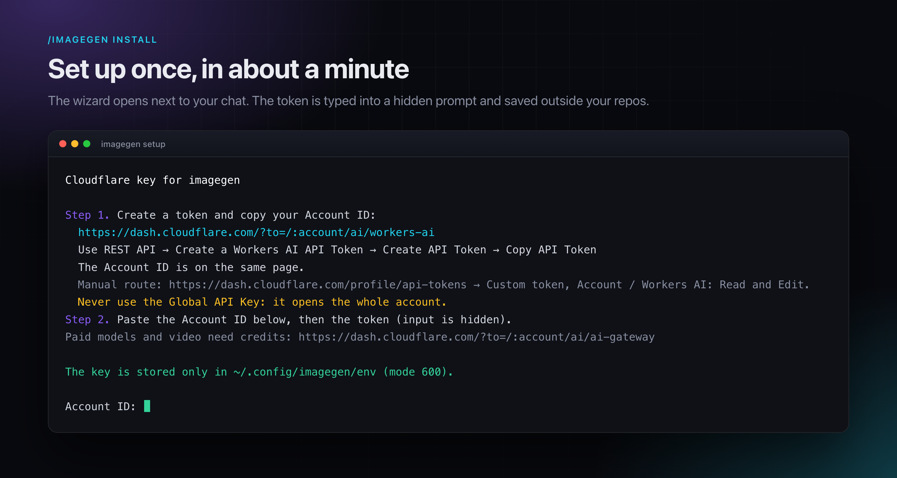
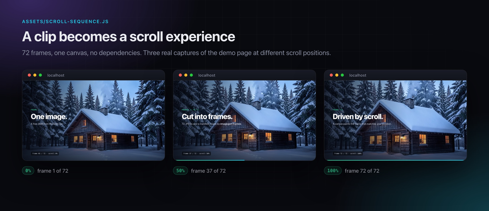

<p align="center">
  
</p>

# claude-image

A [Claude Code](https://code.claude.com/docs) skill that generates images and short videos with FLUX on Cloudflare Workers AI. Ask in plain words and the picture lands in your chat. Drafts are free, and every paid call shows its price first.

- **Free drafts.** The default tier runs on Cloudflare's free daily Workers AI allowance: about 95 images a day at 1024×1024.
- **Price before you pay.** Every paid call is estimated first. Anything above a threshold asks for your OK, video always does, and a monthly budget, a request cache and a ledger sit behind it.
- **The right model for each job.** Draft, final, readable text, hero and video tiers, picked per request.
- **Results land in the chat.** The finished file is sent straight into the conversation where the client supports it (Claude Code Desktop and remote sessions); in a plain terminal you get the path.
- **Scroll-driven sites.** Cut a clip into frames and paint them on a canvas by scroll position, with a dependency-free module.
- **Your key stays yours.** The token is typed into a hidden prompt, stored outside your repos with mode 600, never printed, and Claude is blocked from reading it.

## How it works



1. Type `/imagegen a cozy wooden cabin in a snowy pine forest at dusk`, or just ask in plain words.
2. The first word can steer the flow (`install`, `image`, `video`, `status`); otherwise the skill works out from your text whether you want a photo or a video, and starts on the free draft tier.
3. Anything paid is priced first and runs only after you agree.
4. The picture arrives in the chat, checked once by Claude before it is shown.

The terminal lines and the picture above are real output; the chat frame is an illustration.

## Models and tiers



| Tier | Model | Price | Good for |
|---|---|---|---|
| `draft` | FLUX.2 klein 4B | free daily allowance | iterations, previews, throwaway art |
| `final` | FLUX.2 pro | from $0.03 per megapixel | production images, editing with up to 8 references |
| `text` | FLUX.2 flex | from $0.05 per megapixel | posters, UI mockups, readable typography |
| `hero` | FLUX.2 max | from $0.07 per megapixel | best fidelity, hardest edits |
| `video` | FLUX.3 Video | $0.17 per second in HD (draft $0.06) | 5 to 20 second clips, image-to-video |

Draft runs on Cloudflare's free allowance. The paid prices are Black Forest Labs list prices as of 2026-09-21 and your Cloudflare dashboard shows what you are actually billed. Override the numbers with `imagegen config set prices.pro.first 0.03`.

## Cost guard



- `imagegen estimate ...` prices any request without a key and without a network call.
- Paid requests above $0.10 need `--yes`; video always does. The skill asks you in plain words and passes `--yes` only after you agree.
- A monthly budget ($15 by default), a request cache (an identical request costs nothing) and a spend ledger (`imagegen usage`).
- These guards are local. The hard ceilings live at Cloudflare: the Free Workers AI plan stops at 10,000 neurons a day instead of billing, and paid models draw on prepaid Unified Billing credits. Set a spend limit on the gateway and keep auto top-up off.

## Install

Requirements: Node.js 18 or newer, a Cloudflare account, and ffmpeg if you want the `frames` command.

**As a personal skill:**

```bash
git clone https://github.com/saroroce/claude-image.git
cp -R claude-image/skills/imagegen ~/.claude/skills/imagegen
```

**Or as a plugin:**

```
/plugin marketplace add saroroce/claude-image
/plugin install claude-image@saroroce
```

Use one of the two, not both. Any tool that installs a `SKILL.md` folder from a repository (for example `npx skills add saroroce/claude-image`) should work as well; that route is untested.

## Set up the key



In Claude Code run `/imagegen install`. If a working key already exists it says so and stops; otherwise it opens this wizard in the terminal panel next to your chat (or prints the command when there is no terminal panel). The token is typed into a hidden prompt and never passes through the chat.

1. Open [the Workers AI page](https://dash.cloudflare.com/?to=/:account/ai/workers-ai), press **Use REST API**, then **Create a Workers AI API Token** (the rights are prefilled), **Create API Token** and **Copy API Token**. The Account ID is on the same page.
2. Paste the Account ID, then the token, into the wizard.
3. Optional, for paid models and video: [top up credits](https://dash.cloudflare.com/?to=/:account/ai/ai-gateway) (Credits Available, Manage, Top-up credits). Without credits the API answers `402` and nothing is charged.

Creating the token by hand: [API Tokens](https://dash.cloudflare.com/profile/api-tokens), Create Token, Custom, permission **Account / Workers AI** with **Read** and **Edit**. Never use the Global API Key: it opens the whole account.

The wizard also offers to add a `Read(~/.config/imagegen/**)` deny rule to `~/.claude/settings.json` (a backup is kept), so Claude cannot open the key file.

## Usage

The first word after `/imagegen` picks the flow:

| You type | What happens |
|---|---|
| `/imagegen install` | checks for a saved key, opens the setup wizard if there is none |
| `/imagegen image <text>` or `photo <text>` | image flow: free draft first, paid tiers on request |
| `/imagegen video <text>` | video flow: a still first, then the price, then your OK |
| `/imagegen status` | key check, budget and free allowance (`usage` and `models` also work) |
| `/imagegen <text>` | decides photo or video from the text and the conversation, defaults to a free draft |

Translations of those words route the same way, and asking in plain words without the slash works too.

To use it without Claude, add an alias (the screenshots use it):

```bash
alias imagegen='node ~/.claude/skills/imagegen/scripts/imagegen.mjs'

imagegen photo "a lemon on a marble table" --aspect 1:1
imagegen "a lemon on a marble table"                 # same thing, the tier defaults to draft
imagegen image --tier final "a lemon on a marble table" --aspect 16:9 --yes
imagegen video "a lemon slowly turning" --image lemon.jpg --duration 8 --yes
imagegen help
```

## Scroll-driven video



A plain video scrubbed with `currentTime` stutters, mostly on phones. The robust pattern is an image sequence painted on a canvas by scroll progress, and this repo ships every step of it:

```bash
imagegen video --yes --duration 8 --image still.png "camera slowly pushes in"
imagegen frames clip.mp4 --out public/media/hero --mobile 640
```

`frames` writes numbered frames and a `manifest.json` (WebP when your ffmpeg has libwebp, JPEG otherwise) plus a lighter set for phones. [`assets/scroll-sequence.js`](skills/imagegen/assets/scroll-sequence.js) loads them progressively and draws the frame that matches the scroll position. It has no dependencies, respects `prefers-reduced-motion` and switches to the phone set on small screens. The recipe, size budgets and pitfalls are in [`references/scroll-video.md`](skills/imagegen/references/scroll-video.md). The captures above come from `assets/demo.html` running this module.

Generated video often garbles text and interface details, so generate a clean still first, animate it with `--image`, and overlay real logos and text afterwards.

## Privacy and safety

- The token lives in `~/.config/imagegen/env` (mode 600) or in the `CLOUDFLARE_ACCOUNT_ID` and `CLOUDFLARE_API_TOKEN` variables. It is never printed, never written to the ledger and never sent anywhere except Cloudflare's API.
- Prompts and reference images go to Cloudflare Workers AI and, for the paid FLUX.2 and FLUX.3 models, on to Black Forest Labs.
- The tool sends no telemetry of its own.
- Generated files are yours to place: the default folder is `./generated`, so nothing lands in a public directory unless you say so.

## Status

Verified end to end against the live Cloudflare API: draft images (FLUX.2 klein 4B). Covered by tests against a local mock of the Cloudflare API: every tier, video, frames, the cost guards and the setup wizard, plus a browser check of the scroll module. Paid tiers and video need Unified Billing credits; on an account without credits a video request stops at `402` before anything is generated, so those paths have not yet been run end to end with credits. If a paid call misbehaves, the raw reply is saved to `~/.local/share/imagegen/last-response.json`.

## Development

```bash
npm test                 # needs ffmpeg and, for the pty test, Python 3
bash docs/src/render.sh  # re-renders the README images (macOS, Chrome)
```

## License

Released under the [MIT license](LICENSE).

## Disclaimer

Unofficial: not affiliated with Anthropic, Cloudflare or Black Forest Labs. Prices and model availability change, so check the Cloudflare dashboard before relying on the numbers here.
